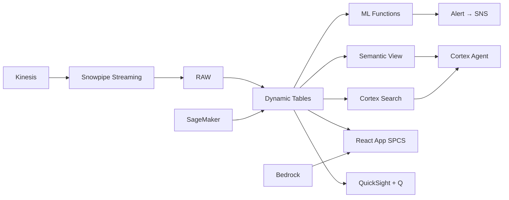

# Pharmaceutical Distribution

Pharmaceutical distribution intelligence for Thailand's ฿200B market — Kinesis streams order data, EventBridge triggers replenishment via Tasks + Streams, ML.FORECAST predicts demand by SKU, and Alerts prevent stockouts.

## Architecture

Thailand's pharmaceutical distribution network serves 5,000 SKUs to hospitals and pharmacies through 9 distribution centers. Reactive ordering creates ฿340M in annual stockout losses while tying up ฿4.8B in excess inventory. ML-powered demand forecasting and event-driven replenishment optimize both service levels and working capital.



## Snowflake Capabilities

| Capability | Implementation |
|-----------|---------------|
| Dynamic Tables | STOCKOUT_RISK / DEMAND_TIMESERIES / SERVICE_LEVEL_METRICS / REPLENISHMENT_SIGNALS |
| ML Functions | ML.FORECAST + ML.ANOMALY_DETECTION |
| Cortex AI | COMPLETE, AI_CLASSIFY, AI_EXTRACT |
| Cortex Search | 500 documents indexed |
| Cortex Agent | PHARMA_SUPPLY_CHAIN_AGENT |
| Semantic View | PHARMA_DISTRIBUTION_ANALYTICS |
| React App (SPCS) | 5 tabs + DemoGuide |


## AWS Services

| Service | Role in Demo |
|---------|-------------|
| Amazon Kinesis | Stream real-time order data from hospital and pharmacy systems |
| Amazon EventBridge | Trigger replenishment workflows on inventory threshold events |
| Amazon SageMaker | Pharmaceutical demand forecasting by SKU and region |
| Amazon Bedrock (Claude) | Generate demand planning narratives and distribution strategy briefs |
| Amazon SNS | Alert supply chain team on stockout risks and demand spikes |
| Amazon QuickSight + Q | Pharma distribution dashboard with NL queries |


## Personas

| Persona | Role | Key Questions |
|---------|------|---------------|
| **Preecha Vorapongchai** | VP Supply Chain (Pharma) | "What's our service level across the network?" "Which SKUs are at stockout risk in the next 7 days?" |
| **Achara Boonprakob** | Demand Planning Manager | "What's the demand forecast for insulin products next quarter?" "Which hospital tenders close this month and how does it affect demand?" |


## Data

| Table | Rows | Description |
|-------|------|-------------|
| DISTRIBUTION_CENTERS | 9 | Bangkok central DC + 8 regional distribution centers |
| PRODUCTS | 5,000 | Pharmaceutical SKUs (ethical, OTC, medical devices) |
| ORDERS | 450,000 | Hospital and pharmacy orders (12 months) |
| INVENTORY | 45,000 | Current inventory levels by SKU and DC (5000 × 9) |
| DEMAND_HISTORY | 1,800,000 | Daily demand by SKU and region (5000 × 9 × ~40 weeks) |
| HOSPITAL_TENDERS | 500 | Government and private hospital tender pipeline |
| SUPPLIER_LEAD_TIMES | 800 | Supplier lead time data by product and origin |
| THAI_PHARMA_MARKET | 10 | Thailand pharmaceutical market statistics |


## Build Instructions

### Prerequisites
- Snowflake account with ACCOUNTADMIN access
- Cortex AI enabled (ML Functions, Search, Agent)
- Warehouse: PHARMA_WH (Medium)
- AWS CLI with access (us-west-2)

### Deployment

```bash
snowsql -f snowflake/00_setup.sql
snowsql -f snowflake/01_marketplace_install.sql
snowsql -f snowflake/02_raw_tables.sql
snowsql -f snowflake/03_staging.sql
snowsql -f snowflake/04_dynamic_tables.sql
snowsql -f snowflake/05_search.sql
snowsql -f snowflake/06_ml_models.sql
snowsql -f snowflake/07_semantic_view.sql
snowsql -f snowflake/08_agent.sql
```

### React App (SPCS)
```bash
cd app && npm ci && npm run build
docker build -t aws-thailand-healthcare-pharma-dist-app .
docker push bdiqc8sm-default.registry.snowflakecomputing.com/pharma_distribution/app/aws_thailand_healthcare_pharma_dist/app:latest
```

### Demo Mode
Open the app URL with `?demo=true` for presenter view.

## Build Modes

### Snowflake Only
Run scripts 00-08 (skip AWS-specific integration). Uses:
- **Snowpipe Streaming SDK** instead of Amazon Kinesis
- **Tasks + Streams (event-driven)** instead of Amazon EventBridge
- **ML.FORECAST (native)** instead of Amazon SageMaker
- **Cortex Complete** instead of Amazon Bedrock (Claude)
- **Alerts + Notification Integration** instead of Amazon SNS
- **Snowflake Intelligence (Cortex Analyst)** instead of Amazon QuickSight + Q

### Full AWS + Snowflake
Run all scripts including AWS integration. Deploy QuickSight dashboard from `quicksight/`.

## Business Impact

Industry research and Snowflake customer outcomes:
- **Thailand's pharmaceutical market valued at ฿200B (US$5.7B) with 5% annual growth** — [Krungsri Research](https://www.krungsri.com/en/research)
- **ML-powered demand forecasting reduces pharmaceutical stockouts by 40-60% and excess inventory by 20-30%** — [McKinsey Pharma Operations](https://www.mckinsey.com/industries/life-sciences/our-insights)
- **Event-driven replenishment reduces order-to-delivery cycle time by 50% vs batch processing** — [Gartner Supply Chain](https://www.gartner.com/en/supply-chain)
- **Zuellig Pharma (Thailand) distributes to 30,000+ points of care across the country** — [Zuellig Pharma](https://www.zuelligpharma.com/)
- **Sanofi** (Snowflake customer): 50% performance improvement, processing 100M patient records in 4 minutes on Snowflake -- [snowflake.com/customers/sanofi](https://www.snowflake.com/en/customers/all-customers/case-study/sanofi/)

## Key Demo Numbers

- **96.8%** service level (target: 99.2%) — ฿340M in stockout losses
- **47 SKUs** at critical stockout risk within 7 days
- **฿4.8B** working capital in inventory (฿720M reduction opportunity)
- **45,000 forecasts** SKU-region demand predictions updated daily
- **450K orders** processed annually across 9 distribution centers
- **2-hour cycle** from demand signal to replenishment PO generation


## License

Apache 2.0 — See [LICENSE](LICENSE) for details.

This is a personal demo project and is not an official Snowflake offering. It comes with no support or warranty.